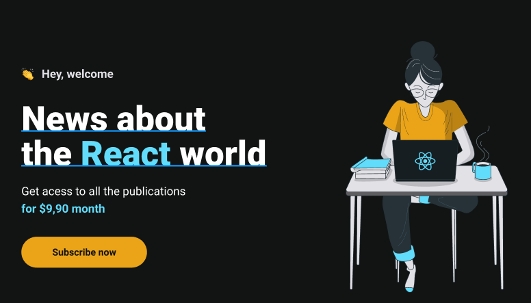

  

 

  Plataforma de noticias para desenvolvedores. Projeto desenvolvido na trilha de react do curso ignite(rocketseat)

 

  

 

## ⚡ Stack utilizada

- [NextJS](https://nextjs.org)
- [Typescript](https://www.typescriptlang.org)
- [Styled Components](https://styled-components.com/)
- [Next auth](https://next-auth.js.org/)
- [stripe](https://stripe.com)
- [Fauna DB](https://fauna.com/)
- [Prismic CMS](https://prismic.io/)
